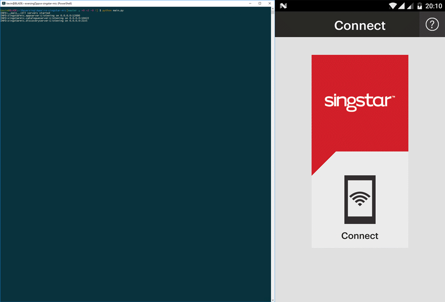

# SingStar Mic documentation
The SingStar Mic app for Android and iOS is an app that you can use to replace your SingStar microphones with. This is a handy feature and seeing as there are numerous other open source Karaoke programs available, it would make sense to have some interoperability with the SingStar Mic app as it a well written application.

This repository contains the full protocol definition and a simple proof of concept server in python to see how this could work.

## Quick start
If you have python3 installed you should be able to run this without any need for packages or dependencies. After you can open the app on your phone (**make sure you are on the same network**) and discover for services. You should see "Karaoke Party!" and the rest should work.
```
python main.py
```

## Commands
| Module    | Command     | Arguments | Description                                                                                                                                                                                      |
|-----------|-------------|-----------|--------------------------------------------------------------------------------------------------------------------------------------------------------------------------------------------------|
| appserver | performance | state     | state can be enable, disable, start or stop which sets the performance in the correct action. When starting a performance it will record the audio from the app into a file named `mic_<ip>.raw` |

## Demo

Yes I know, I should have enlarged the command line text... sorry!

## Architecture
```
                  +------------+
                  |  SingStar  |
                  |    App     |
                  |            |
                  |  Android   |
                  |    iOS     |
                  +------------+
                   ^     ^    ^
                 /       |      \
               /         |        \
             /           |          \
           v             v            v
+------------+    +------------+      +------------+
| Discovery  |    |  App/Game  |      | Catalogue  |
|  Service   |    |   Service  |<---->|  Service   |
| UDP 2155   |    | UDP 12000  |      | HTTP 10422 |
+------------+    +------------+      +------------+
```

## Discovery Service
- Port: 2155
- Protocol: UDP

The discovery service is a simple service that waits on UDP broadcasts packets with a specific HTTP kind of request. When it receives this request it returns a HTTP like response describing the name of the service and a host identifier.

### Request
The request looks like this but the `SRCH` keyword does not exists in the HTTP specifications
```
SRCH * HTTP/1.1
ST: device-discovery-protocol-version:00000000
```

### Response
The response looks like this which is actually somewhat according HTTP specifications. However, the headers are **space and case sensitive** which is not according to specs. The `host-type:mic` and `host-request-port:2155` is always the same and probably not being checked against.
```
HTTP/1.1 300 OK
host-name:This is the name
host-type:mic
host-request-port:2155
host-id:fa5fd316-5c1d-4e55-bbc8-b1534245da1e
```

## Catalogue Service
- Port: 10422
- Protocol: HTTP

The catalogue service is a "REST" service that is responsible for serving the playlist and catalogue information to the app. This feature can be used by all people who have the app and are on the same network to add, remove and reorder the songs in the playlist. This playlist information can then be used by the karaoke program to keep playing songs without having an individual do this.

### Data specifications
#### Catalogue
##### JSON Schema
```
{
	"title": "Catalogue",
	"type": "object",
	"properties": {
		"albumUrl": {
			"description": "An image URL where %d will be replaced with the song identifier.",
			"type": "string"
		},
		"songs": {
			"title": "Song",
			"description": "A dictionary of songs where the key is the song identifier. The id can only contain valid characters that are also valid in an URL as it will be used as a replacement for the %d in the albumUrl.",
			"type": "object",
			"properties": {
				"artist": {
					"type": "string"
				},
				"title": {
					"type": "string"
				}
			},
			"required": ["artist", "title"]
		}
	},
	"required": ["albumUrl", "songs"]
}
```

##### JSON Example
```
{
	"albumUrl": "http://192.168.1.100:10422/images/%d",
	"songs": {
		"song-gorillaz-humanz-ascension": {
			"artist": "Gorillaz",
			"title": "Ascension feat. Vince Staples"
		},
		"song-gorillaz-humanz-strobelite": {
			"artist": "Gorillaz",
			"title": "Strobelite feat. Peven Everett"
		},
		"song-gorillaz-humanz-saturnz-barz": {
			"artist": "Gorillaz",
			"title": "Saturnz Barz feat. Popcaan"
		}
	}
}
```

#### Playlist
##### JSON Schema
```
{
	"title": "Playlist",
	"type": "object",
	"properties": {
		"versionId": {
			"description": "A version number that can be used to keep track of version differences between different devices.",
			"type": "integer"
		},
		"array": {
			"title": "Array",
			"description": "An array of songs which also defined the order of the playlist.",
			"type": "array",
			"items": {
				"type": "object",
				"properties": {
					"entryId": {
						"type": "integer",
						"description": "Identifier of this song in the playlist, this will also be used as reference for moving and deletion."
					},
					"songId": {
						"type": "string",
						"description": "Exact same identifier as being used in the songs dictionary in the catalogue."
					},
					"state": {
						"type": "string",
						"enum": ["played", "nextup", "queued", "currentPlaying", "none"]
					}
				},
				"required": ["entryId", "songId", "state"]
			}
		}
	},
	"required": ["versionId", "array"]
}
```

##### JSON Example
```
{
	"versionId": 12,
	"array": [
		{
			"entryId": 1,
			"songId": "song-gorillaz-humanz-ascension",
			"state": "nextUp"
		},
		{
			"entryId": 0,
			"songId": "song-gorillaz-humanz-strobelite",
			"state": "currentPlaying"
		},
		{
			"entryId": 2,
			"songId": "song-gorillaz-humanz-saturnz-barz",
			"state": "none"
		}
	]
}
```

### Endpoints
#### GET getCatalogue
Returns the catalogue in the JSON specified above.

#### GET getPlaylist
Return the playlist in the JSON format specified above.

#### POST addPlaylist
This endpoint is responsible for adding zero or more songs from the catalogue to the current playlist. After this is done the app/game service has to tell all clients to refresh the playlist.

The body of the request will contain pseudo JSON in the following format `[song-id, song-id-2, etc]`. The identifiers are also not quoted which lets me to believe it actually should be numeric but this is not enforced.

This endpoint does not return data.

#### POST orderPlaylist
This endpoint is called when moving a song in the playlist to another position within the same playlist (drag and drop). After this is done the app/game service has to tell all clients to refresh the playlist.

The body of the request is actual JSON in the following format `{"versionId": x, "entryId": y, "offset": z}`. The offset can be positive or negative as it is the offset relative to the current position in the list.

This endpoint does not return data.

#### POST deletePlaylist
This endpoint is called when deleting zero or more songs from a playlist. After this is done the app/game service has to tell all clients to refresh the playlist.

The body of the request is actual JSON in the following format `{"versionId": x, "array": [entryId, entryId]}`. All the entries in the array should be deleted from the playlist.

This endpoint does not return data.

## App/Game Service
- Port: 12000
- Protocol: UDP
- Byte order: BIG_ENDIAN
- Packet size: 800
- Max packet size: 8000

### Audio format
- 16-bit PCM
- Default byte order
- Raw data
- Mono
- 16000 Hz

### Protocol
The basic packet structure is given here, this is the packet header and is send with every packet. The integers are always signed and I guess this is due to the fact that Java is being used which did not support unsigned integers.
<table>
	<thead>
		<tr>
			<th>Bit offset</th>
			<th>0</th>
			<th>8</th>
			<th>16</th>
			<th>24</th>
		</tr>
	</thead>
	<tbody>
		<tr>
			<th>0</th>
			<td colspan="4">Data size</td>
		</tr>
		<tr>
			<th>32</th>
			<td colspan="4">Command</td>
		</tr>
		<tr>
			<th>64</th>
			<td colspan="4">Sequence number</td>
		</tr>
		<tr>
			<th>96<br/>...</th>
			<td colspan="4">Zero or more data bytes given by data size</td>
		</tr>
	</tbody>
</table>

#### Reliable packets
Because the app uses UDP they had to come up with a way to have a reliable packet stream as well. The implementation is simple and done using a sequence counter per client. Each reliable packet gets this sequence number and it requires an acknowledgment. The packet is retried for a maximum of **3** times with a backoff time of 500, 1000 and 2000 milliseconds.

#### Commands
| Sendto    | Reliable | Command               | Value | Description |
|-----------|----------|-----------------------|-------|-------------|
| server    | Yes      | CONNECT               | 0     | Tells the server that the client connected |
| server    | No       | DISCONNECT            | 1     | Tells the server that the client disconnected |
| client    | Yes      | RTT                   | 2     | Ping/pong system which prevents the client from timing out |
| both      | No       | ACK                   | 3     | Acknowledge receive of a packet, if this is not send it will retry for all reliable packets. This sequence number in the header will define which packet is being acknowledged |
| client    | Yes      | CONNECTION_CHALLENGE  | 4     | Indicates that the client should enter a code which can be shown by the game |
| server    | Yes      | CONNECTION_CODE       | 5     | Tells the entered code to the server for verification |
| client    | Yes      | CONNECTION_SUCCESSFUL | 6     | Indicates that either the code is correct or the client was already verified |
| client    | Yes      | CONNECTION_ERROR      | 7     | Indicates that the entered code is incorrect |
| server    | No       | AUDIO                 | 256   | The raw audio stream |
| client    | Yes      | MIC_SET               | 257   | Indicates to the client if it is either player one or two |
| both      | Yes      | TIME_SYNC             | 258   | Requests the client to send its time since origin packet back to the server |
| client    | Yes      | PERFORMANCE           | 259   | Starts or stop the performance in essence starting the sending of the audio if the player is in the microphone section of the app |
| server    | Yes      | STATE_SELECTION       | 260   | Tells the server what the current selected screen is for this client |
| client    | Yes      | PEERS_STATE           | 261   | Indicates the state of other peers to the client |
| client    | Yes      | CATALOGUE_REFRESH     | 262   | Indicates that the catalogue has changed and the client should refresh the catalogue |
| client    | Yes      | PLAYLIST_REFRESH      | 263   | Indicates that the playlist has changed and the client should refresh the playlist |
| client    | Yes      | MIC_STATE             | 264   | Indicates how many microphone slots are available and used (visually only supports two) |
| client    | Yes      | CURRENT_SONG      | 265   | Indicates the current playing song by entryId |
| server    | Yes      | TELEMETRY             | 266   | Tells the server some telemetry information about the client |
| client    | Yes      | SESSION               | 267   | Indicates the current game session identifier |

#### Packets
All packets are prepended with the header section. Only the data structure for each packet is shown here. If a command is not given here it is due to it now having data.

##### CONNECT
<table>
	<thead>
		<tr>
			<th>Bit offset</th>
			<th>0</th>
			<th>8</th>
			<th>16</th>
			<th>24</th>
		</tr>
	</thead>
	<tbody>
		<tr>
			<th>96</th>
			<td colspan="4">UUID length</td>
		</tr>
		<tr>
			<th>128</th>
			<td colspan="4">UUID <i>(MAC address of the WiFi adapter, however my devices always show 02:00:00:00:00:00)</i></td>
		</tr>
		<tr>
			<th>128 + len(UUID)</th>
			<td colspan="4">App version (131073 as of 03/25/2017)</td>
		</tr>
	</tbody>
</table>

##### CONNECTION_CODE
<table>
	<thead>
		<tr>
			<th>Bit offset</th>
			<th>0</th>
			<th>8</th>
			<th>16</th>
			<th>24</th>
		</tr>
	</thead>
	<tbody>
		<tr>
			<th>96</th>
			<td colspan="4">Code length</td>
		</tr>
		<tr>
			<th>128</th>
			<td colspan="4">Code <i>(Code always consistent out of four bytes)</i></td>
		</tr>
	</tbody>
</table>

##### CONNECTION_ERROR
<table>
	<thead>
		<tr>
			<th>Bit offset</th>
			<th>0</th>
			<th>8</th>
			<th>16</th>
			<th>24</th>
		</tr>
	</thead>
	<tbody>
		<tr>
			<th>96</th>
			<td colspan="4">Error code (signed int)</td>
		</tr>
	</tbody>
</table>

The different error codes are as follows

| Code  | Name                         | Description |
|-------|------------------------------|-------------|
| -1    | INVALID                      | *Unknown* |
| 0     | TOO_MANY_CONNECTIONS         | To many players are connected to the server |
| 1     | FAILED_CODE_ENTRY            | The code is not equal to the code on the server |
| 2     | VERSION_MISMATCH             | The app version is not supported by the server |
| 3     | INVALID_IDENTIFIER           | *Unknown* |
| 4     | MAX                          | *Unknown* |
| 6     | HIGHER_PRIORITY_MIC_INSERTED | **Guessed** USB microphone inserted which supersedes the SingStar Mic app |
| 20    | NETWORK_ERROR_DISCONNECT     | **Guessed** generic network error|
| 21    | USER_DISCONNECT              | **Guessed** User is not responding on packets |
| 22    | NO_GAMES_FOUND               | Either the game has closed down or the app is not on the same network |

##### AUDIO
<table>
	<thead>
		<tr>
			<th>Bit offset</th>
			<th>0</th>
			<th>8</th>
			<th>16</th>
			<th>24</th>
		</tr>
	</thead>
	<tbody>
		<tr>
			<th>96</th>
			<td colspan="4">Packet counter (signed int)</td>
		</tr>
		<tr>
			<th>128</th>
			<td colspan="4" rowspan="2">Current time in microseconds</td>
		</tr>
		<tr>
			<th>160</th>
		</tr>
		<tr>
			<th>192</th>
			<td colspan="4" rowspan="2">Start time in microseconds</td>
		</tr>
		<tr>
			<th>224</th>
		</tr>
		<tr>
			<th>256</th>
			<td colspan="4">Audio length</td>
		</tr>
		<tr>
			<th>288<br/>...</th>
			<td colspan="4">The audio sample.</td>
		</tr>
	</tbody>
</table>

##### MIC_SET
<table>
	<thead>
		<tr>
			<th>Bit offset</th>
			<th>0</th>
			<th>8</th>
			<th>16</th>
			<th>24</th>
		</tr>
	</thead>
	<tbody>
		<tr>
			<th>96</th>
			<td colspan="4">The microphone for this player, zero for player one, one for player two (other values will show gray disabled microphone).</td>
		</tr>
	</tbody>
</table>

##### PERFORMANCE
<table>
	<thead>
		<tr>
			<th>Bit offset</th>
			<th>0</th>
			<th>8</th>
			<th>16</th>
			<th>24</th>
		</tr>
	</thead>
	<tbody>
		<tr>
			<th>96</th>
			<td>zero for performance start, else stops the performance.</td>
		</tr>
	</tbody>
</table>

##### PEERS_STATE
<table>
	<thead>
		<tr>
			<th>Bit offset</th>
			<th>0</th>
			<th>8</th>
			<th>16</th>
			<th>24</th>
			<th>32</th>
			<th>40</th>
		</tr>
	</thead>
	<tbody>
		<tr>
			<th>96</th>
			<td>peer index for this player</td>
			<td>total peers</td>
			<td colspan="4">Peer state (repeats "total peers" times)</td>
		</tr>
	</tbody>
</table>

The peer state can have one of the following values

| Value | Name     | Description |
|-------|----------|-------------|
| -1    | HOME     | The home screen |
| 1     | MIC      | The microphone screen, however the MIC_STATE is actually used for indicating that |
| 3     | VFX      | *Unknown* |
| 4     | PLAYLIST | The playlist/catalogue screen |

##### MIC_STATE
The app visually only supports two players, but you can actually send 5 slots in use and 6 available slots and the app will show only one slot in use.
<table>
	<thead>
		<tr>
			<th>Bit offset</th>
			<th>0</th>
			<th>8</th>
			<th>16</th>
			<th>24</th>
		</tr>
	</thead>
	<tbody>
		<tr>
			<th>96</th>
			<td colspan="4">Number of slots used</td>
		</tr>
		<tr>
			<th>128</th>
			<td colspan="4">Total available slots</td>
		</tr>
	</tbody>
</table>

##### CURRENT_SONG
This seems to not do anything within the app, perhaps this got superseeded by using the "state" in the playlist JSON.
<table>
	<thead>
		<tr>
			<th>Bit offset</th>
			<th>0</th>
			<th>8</th>
			<th>16</th>
			<th>24</th>
		</tr>
	</thead>
	<tbody>
		<tr>
			<th>96</th>
			<td colspan="4">Song entry id that is currently being played</td>
		</tr>
	</tbody>
</table>

##### SESSION
This really is only being used in analytics of the app and I can not see a functional purpose for the session within the app.
<table>
	<thead>
		<tr>
			<th>Bit offset</th>
			<th>0</th>
			<th>8</th>
			<th>16</th>
			<th>24</th>
		</tr>
	</thead>
	<tbody>
		<tr>
			<th>96</th>
			<td colspan="4">Length of the session identifier</td>
		</tr>
		<tr>
			<th>128<br/>...</th>
			<td colspan="4">Game session identifier as a string</td>
		</tr>
	</tbody>
</table>

## Disclaimer
This work is completely done by me and purely for educational purposes.
